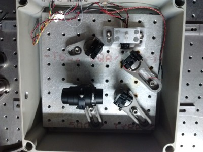

# grating-ecdl

### Grating-based external cavity diode laser design

This is a design for a traditional-syyle external cavity diode laser, based on commercial off-the-shelf parts. A separate parts list and drawings can be found in this repository.

## Assembly instructions

0. Drill holes in the box for feeding through the current controller, temperature controller and piezo driver.

1. Glue a thermistor into the diode mount using a thermally conductive epoxy. Place a TEC between the two pieces of the diode mount. Put the diode in a collimation tube, power it up and collimate it. Slide the diode + collimation tube into the diode mount. 

2. Rotate the diode collimation tube so that the wider axis of its elliptical output is horizontal (in the plane of the breadboard). Fix the collimation tube in the mount using 4-40 nylon screws.

3. Glue the grating onto a kinematic mount. Make sure that the grating is oriented correctly: the grating should diffract in the horizontal plane. 

4. Adjust the grating angle so that the first-order beam is diffracted back into the diode. You may need to align the vertical overlap carefully, and iterate between vertical and horizontal alignment a few times. The specular reflection is the output beam.

5. Put in a couple of mirrors on kinematic mounts to give you enough degrees of freedom to send the output beam through an isolator. 

6. (Optional) Put in an anamorphic prism pair to circularize the output beam, before the isolator. Put pads of sorbothane underneath the breadboard. Add foam padding around the box for acoustic isolation.

